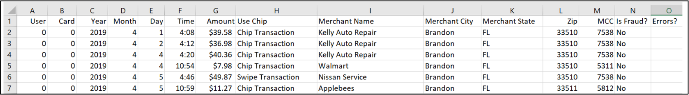

# Tabular Transformers for Modeling Multivariate Time Series

This repository provides the pytorch source code, and data for tabular transformers (TabFormer). Details are described in the paper [Tabular Transformers for Modeling Multivariate Time Series](http://arxiv.org/abs/2011.01843 ), to be presented at ICASSP 2021.

#### Summary
* Modules for hierarchical transformers for tabular data
* A synthetic credit card transaction dataset
* Modified Adaptive Softmax for handling masking
* Modified _DataCollatorForLanguageModeling_ for tabular data
* The modules are built within transformers from HuggingFace 🤗. (HuggingFace is ❤️)
---
### Requirements
* Python (3.7)
* Pytorch (1.6.0)
* HuggingFace / Transformer (3.2.0)
* scikit-learn (0.23.2)
* Pandas (1.1.2)

(X) represents the versions which code is tested on.

These can be installed using yaml by running : 
```
conda env create -f setup.yml
```
---

### Credit Card Transaction Dataset

The synthetic credit card transaction dataset is provided in [./data/credit_card](/data/credit_card/). There are 24M records with 12 fields.
You would need git-lfs to access the data. If you are facing issue related to LFS bandwidth, you can use this [direct link](https://ibm.box.com/v/tabformer-data) to access the data. You can then ignore git-lfs files by prefixing `GIT_LFS_SKIP_SMUDGE=1` to the `git clone ..` command.



---

### PRSA Dataset
For PRSA dataset, one have to download the PRSA dataset from [Kaggle](https://www.kaggle.com/sid321axn/beijing-multisite-airquality-data-set) and place them in [./data/card](/data/card/) directory.

---

### Pretrain Tabular BERT
To train a tabular BERT model on credit card transaction or PRSA dataset run :
```
$ python main.py --do_train --mlm --field_ce --lm_type bert \
                 --field_hs 64 --data_type [prsa/card] \
                 --output_dir [output_dir]
```


### Train Downstream task on output embeddings of Pretrain Tabular BERT
To train a LSTM on a downstream task using the pretrained data (inside the you only need to update the checkpoint number) :
```
$ bash finetune.sh 
```

### Train Downstream task on raw features 
To train a LSTM on a downstream task using the raw features of the dataset
```
$ bash finetune_raw.sh 
```


### Citation

```
@inproceedings{padhi2021tabular,
  title={Tabular transformers for modeling multivariate time series},
  author={Padhi, Inkit and Schiff, Yair and Melnyk, Igor and Rigotti, Mattia and Mroueh, Youssef and Dognin, Pierre and Ross, Jerret and Nair, Ravi and Altman, Erik},
  booktitle={ICASSP 2021-2021 IEEE International Conference on Acoustics, Speech and Signal Processing (ICASSP)},
  pages={3565--3569},
  year={2021},
  organization={IEEE},
  url={https://ieeexplore.ieee.org/document/9414142}
}
```
